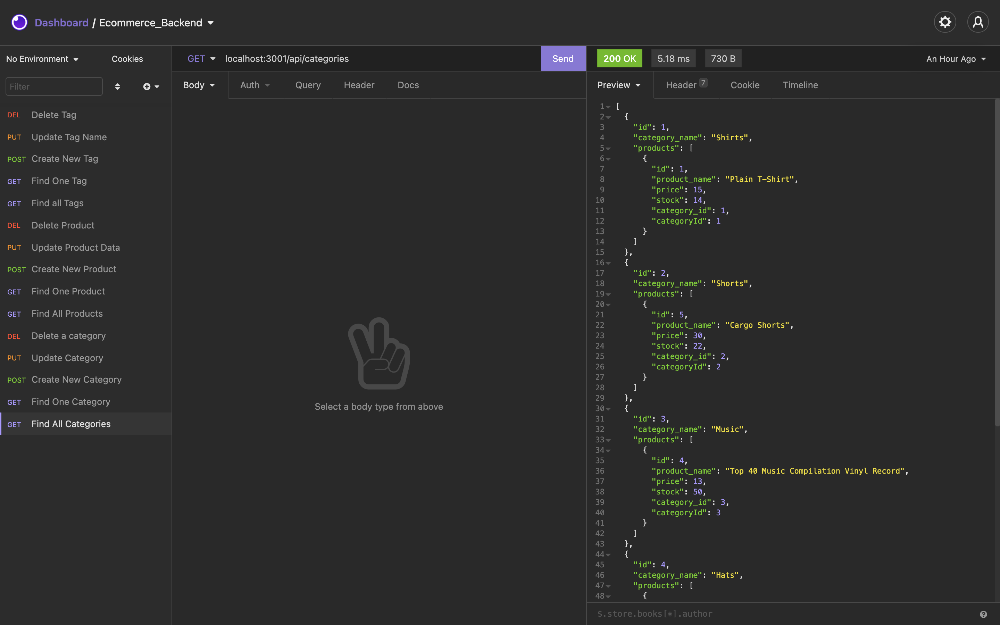

# E-commerce Back End

## Description 

This application is a backend example for an E-Commerce site.  This application primarily uses the promised-based Node.js ORM called Sequelize.  Combined with MySQL and Express.js, a user can successfully make CRUD API requests that interact with a database.  Having the ability to perform CRUD operations on a database with multiple methods is a crucial component of any modern full-stack application.  With ORM (Object-Relational Mapping), a developer can create complex database interactions in the code of their choosing, which adds another tool to their arsenal.  To use this application, please watch this quickstart guide:  https://drive.google.com/file/d/1UVDMEN5NPxsuHSjZVfm8HJGoxwQGJIpQ/view?usp=sharing


 

## Table of Contents 

* [Installation](#installation)
* [Usage](#usage)
* [Credits](#credits)
* [License](#license)

## Installation 

To install this application, you must have Node.js and MySQL installed on your computer (https://nodejs.org/en/download/) (https://www.mysql.com/downloads/).  Once installed, follow these steps:  

1. At this projects GitHub Repo, click on the green code button and download the .ZIP file.

2. Extract the contents of the .ZIP file on you computer.  

3. Download the required dependencies for this project by opening the root dir with terminal, and then type in the command ``` npm install ```, which will download all necessary dependencies.

4. Once the dependencies are installed, to create a database, from the root dir, go to your terminal and enter the command ``` mysql -u root -p ```, enter your password.

5. When you've successfully entered the MySql CLI, enter the command ``` source db/schema.sql ```.  This will create the database ```ecommerce_db```.

6. In order for the database to interact with the server, go to the ```.env``` file and change the value of ```DB_PASS``` to your local MySQL password.

7.  After that, leave the MySQL shell by using the ```quit```command.  Go back to the root dir in terminal and run the command ```npm run seed```.  This will populate your database with tables and rows.

If you have any questions, please watch the quickstart guide: https://drive.google.com/file/d/1UVDMEN5NPxsuHSjZVfm8HJGoxwQGJIpQ/view?usp=sharing


## Usage 

To use this application, it is recommended to have an API client installed on your machine:

1. Open the root dir with terminal, Git Bash, or any other terminal based CLI.  The root folder should be called ```Ecom-backend```.

2. Run the command: ```npm start``` This will create a local server on port 3001.

4. Go to your API Client. You can now make API requests from "localhost:3001"! The endpoints that are used in this application are ```/api/categories```, ```/api/products```, and ```/api/tags```.  You can do all CRUD operations with each endpoint!

If you have any questions, please watch the quickstart guide: https://drive.google.com/file/d/1UVDMEN5NPxsuHSjZVfm8HJGoxwQGJIpQ/view?usp=sharing


## Credits  

* https://github.com/coding-boot-camp/fantastic-umbrella


## License 

MIT License

Copyright (c) 2021 Nick Giuliani

Permission is hereby granted, free of charge, to any person obtaining a copy
of this software and associated documentation files (the "Software"), to deal
in the Software without restriction, including without limitation the rights
to use, copy, modify, merge, publish, distribute, sublicense, and/or sell
copies of the Software, and to permit persons to whom the Software is
furnished to do so, subject to the following conditions:

The above copyright notice and this permission notice shall be included in all
copies or substantial portions of the Software.

THE SOFTWARE IS PROVIDED "AS IS", WITHOUT WARRANTY OF ANY KIND, EXPRESS OR
IMPLIED, INCLUDING BUT NOT LIMITED TO THE WARRANTIES OF MERCHANTABILITY,
FITNESS FOR A PARTICULAR PURPOSE AND NONINFRINGEMENT. IN NO EVENT SHALL THE
AUTHORS OR COPYRIGHT HOLDERS BE LIABLE FOR ANY CLAIM, DAMAGES OR OTHER
LIABILITY, WHETHER IN AN ACTION OF CONTRACT, TORT OR OTHERWISE, ARISING FROM,
OUT OF OR IN CONNECTION WITH THE SOFTWARE OR THE USE OR OTHER DEALINGS IN THE
SOFTWARE.